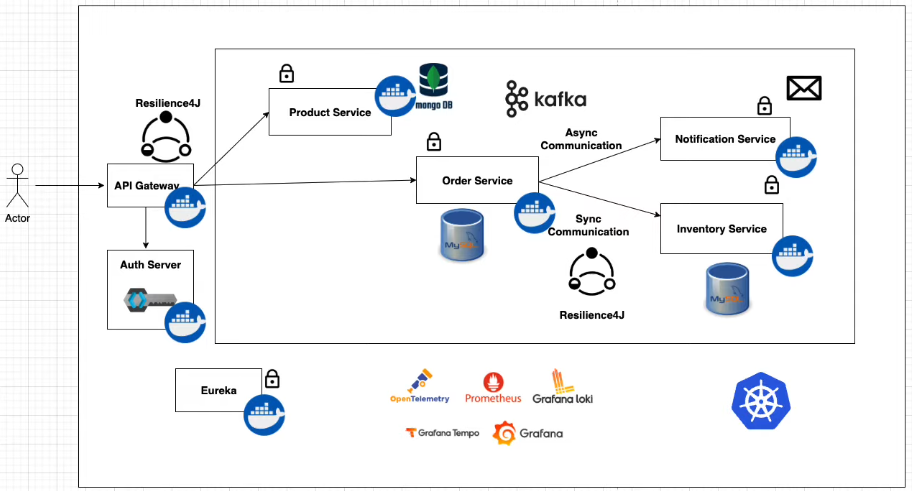
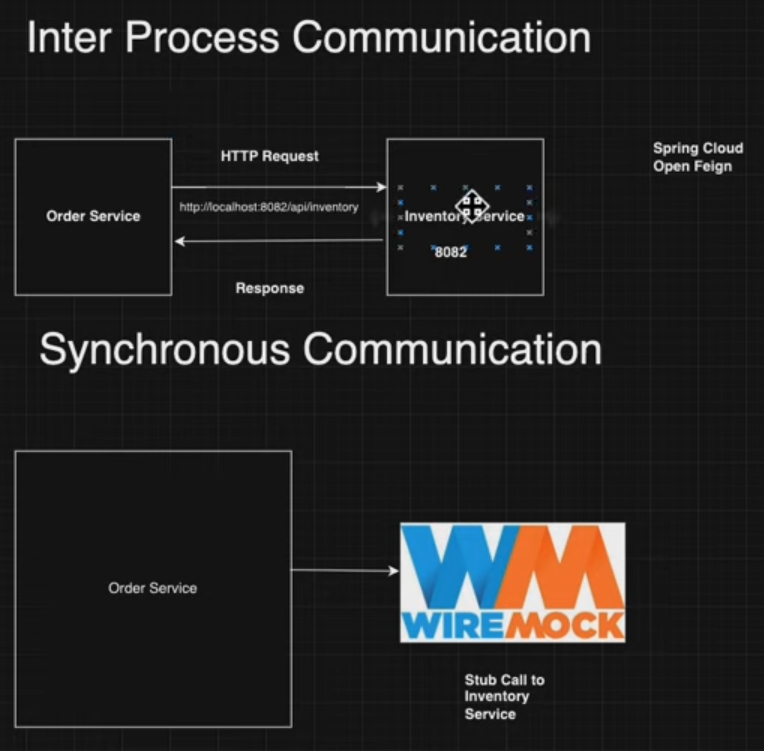

## Описание проекта

Проект представляет собой монорепозиторий, включающий несколько микросервисов для реализации платформы по продаже товаров. 

Основная функциональность включает управление товарами, заказами, инвентаризацией, уведомлениями, а также централизованную авторизацию и маршрутизацию запросов. 

Монорепозиторий упрощает управление зависимостями между микросервисами и позволяет централизованно поддерживать CI/CD.

### Ключевые функциональные модули:

1. **product-service** — управление товарами (создание, обновление, удаление, просмотр).
2. **order-service** — управление заказами.
3. **inventory-service** — контроль запасов товаров на складах.
4. **notification-service** — отправка уведомлений клиентам через разные каналы (email, SMS).

### Основные компоненты платформы:

- **API Gateway** — маршрутизация запросов к микросервисам.
- **Auth server (Keycloak)** — централизованная авторизация и аутентификация.
- **Eureka** — регистрация и поиск микросервисов.
- **Config Server** — централизованное управление конфигурацией.
- **Zipkin** — распределённый трейсинг.
- **ELK стек** — логирование и мониторинг.
- **Kafka или RabbitMQ** — взаимодействие через сообщения.
- **PostgreSQL и MongoDB** — базы данных для микросервисов.
- **Resilience4J** — управление отказоустойчивостью.

## Структура проекта



```
shopping-application-demo/
├── api-gateway/
│   ├── src/
│   │   ├── main/
│   │   │   ├── java/
│   │   │   ├── resources/
│   │   │   │   ├── application.yml
│   ├── build.gradle
├── auth-server/
│   ├── config/
│   │   ├── realms/
│   │   │   ├── e-commerce-realm.json
├── config-server/
│   ├── src/
│   │   ├── main/
│   │   │   ├── java/
│   │   │   ├── resources/
│   │   │   │   ├── application.yml
│   ├── build.gradle
├── eureka-server/
│   ├── src/
│   │   ├── main/
│   │   │   ├── java/
│   │   │   ├── resources/
│   │   │   │   ├── application.yml
│   ├── build.gradle
├── product-service/
│   ├── src/
│   │   ├── main/
│   │   │   ├── java/
│   │   │   ├── resources/
│   │   │   │   ├── application.yml
│   ├── build.gradle
├── order-service/
│   ├── src/
│   │   ├── main/
│   │   │   ├── java/
│   │   │   ├── resources/
│   │   │   │   ├── application.yml
│   ├── build.gradle
├── inventory-service/
│   ├── src/
│   │   ├── main/
│   │   │   ├── java/
│   │   │   ├── resources/
│   │   │   │   ├── application.yml
│   ├── build.gradle
├── notification-service/
│   ├── src/
│   │   ├── main/
│   │   │   ├── java/
│   │   │   ├── resources/
│   │   │   │   ├── application.yml
│   ├── build.gradle
├── kafka/
│   ├── docker-compose.yml
├── elk/
│   ├── docker-compose.yml
├── zipkin/
│   ├── docker-compose.yml
├── .gitignore
├── README.md
├── docker-compose.yml
```

## Краткое описание микросервисов

1. **API Gateway**
    - Использует Spring Cloud Gateway.
    - Управляет маршрутизацией и безопасностью.

2. **Auth Server**
    - Базируется на Keycloak.
    - Реализует OAuth2 и OpenID Connect для авторизации.

3. **Config Server**
    - Использует Spring Cloud Config.
    - Обеспечивает централизованное управление конфигурациями.

4. **Eureka Server**
    - Реализует динамическую регистрацию и обнаружение сервисов.

5. **product-service**
    - Использует PostgreSQL для хранения информации о товарах.
    - Реализует CRUD-операции.

6. **order-service**
    - Использует PostgreSQL.
    - Обрабатывает заказы и связывается с inventory-service.

7. **inventory-service**
    - Использует MongoDB.
    - Отслеживает наличие товаров на складах.

8. **notification-service**
    - Использует Kafka или RabbitMQ.
    - Отправляет уведомления клиентам.

## Полный список технологий

1. **Spring Boot** — для разработки микросервисов.
2. **Spring Cloud** — Eureka, Config Server, Gateway.
3. **Keycloak** — аутентификация и авторизация.
4. **PostgreSQL** и **MongoDB** — базы данных.
5. **Kafka** или **RabbitMQ** — обработка сообщений.
6. **Zipkin** — трейсинг.
7. **ELK стек** — логирование.
8. **Resilience4J** — управление отказоустойчивостью.
9. **Docker** и **Docker Compose** — контейнеризация.
10. **Gradle** — управление сборкой.
11. **Git** — система контроля версий.

## Памятки





